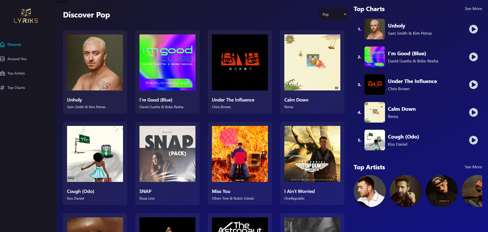

# Lyrics

## A Spotify Clone

This is an open source spotify clone made using ReactJS Shazam Core from RapidAPI and Redux for state Management.
Songs are approximately 1:30 in length and it is responsive in all devices

### Features

1. Lyrics
2. Search songs
3. Customized songs by Geo-Location
4. Top Artists and Charts

## How to install

1. Clone the repository or download the zip file
2. Run npm install
3. Run npm run dev

## How to contribute

[Read how to contribute on open source by making a pull request](https://docs.github.com/en/pull-requests/collaborating-with-pull-requests/proposing-changes-to-your-work-with-pull-requests/creating-a-pull-request)

CHEERS 💻🚀🥳🎉
